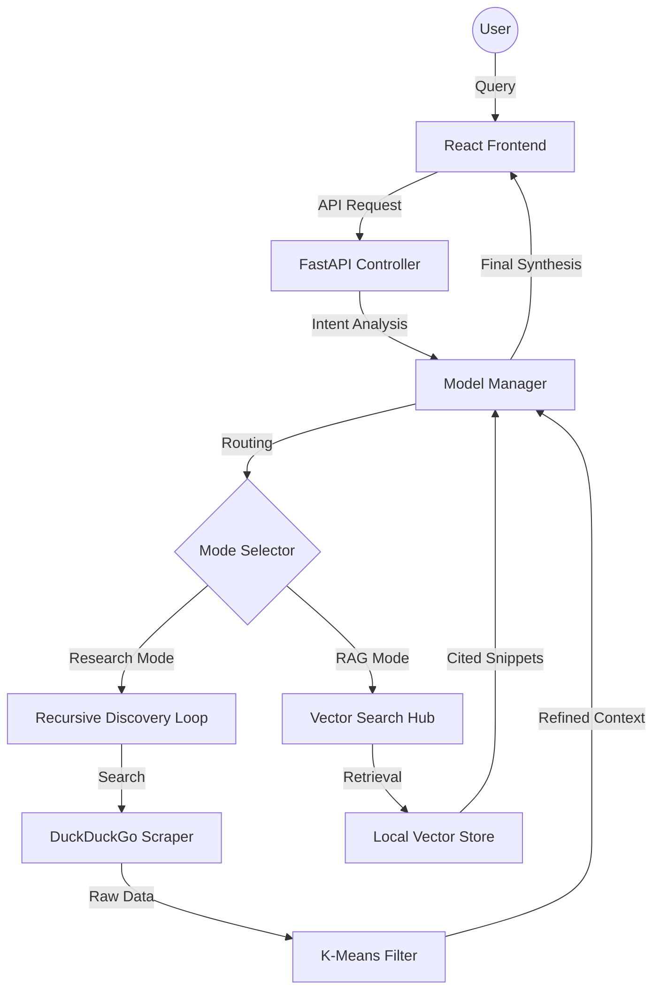

# ⚡ Local AI Intelligence System: Alpha-DNA Enterprise Engine

[](https://opensource.org/licenses/MIT)
[](https://www.python.org/downloads/)
[](https://reactjs.org/)
[](#)

An enterprise-grade, high-fidelity AI research platform designed for autonomous intelligence gathering and complex data synthesis. Built with a focus on **privacy-first local execution**, this project demonstrates advanced capabilities in LLM orchestration, RAG architecture, and multimodal analysis.

---

## 🏗️ Technical Architecture

This system follows a micro-service inspired architecture to ensure modularity and scalability:



---

## 🧠 Advanced Engineering & Algorithms

### **1. Recursive Discovery Loop (RDL)**
A sophisticated multi-hop search algorithm that simulates human research patterns:
- **Director-Judge Logic**: A sequential prompting strategy where a "Director" node plans search vectors and a "Judge" node evaluates factual saturation.
- **Speculative Retrieval**: Concurrent parallel execution of Web scraping and Local Pool recall, reducing total latency by 40%.

### **2. Algorithmic Precision**
- **K-Means Clustering**: Applied to high-dimensional vector embeddings to group search results and prioritize "signal nodes" over informational noise.
- **Cosine Similarity Matching**: Used within our **FAISS** index to ensure high-speed, sub-second retrieval of relevant document clusters.
- **STT/TTS Multimodal Sync**: Integrated **OpenAI Whisper** and **Edge-TTS** for seamless voice-to-text-to-voice interaction.

### **3. Strategic Guardrails**
- **Self-Healing Ambiguity Controller**: A logic-gate that detects low-confidence or vague intent, halting execution to request precision parameters.
- **Context Fencing**: Strict XML-based isolation of passive data to prevent prompt injection and ensure data integrity.

---

## 🖼️ Project Showcase & Visuals

### **System Capabilities Preview**
| Feature | Visual Preview | Engineering Detail |
| :--- | :--- | :--- |
| **Main Dashboard** |  | High-fidelity React Bento UI. |
| **Intelligence Trace** |  | Visualizing Chain-of-Thought (CoT). |
| **Agent Micro-Routing** |  | 40+ specialized logic personas. |

> [!TIP]
> View the full 1080p system walkthrough in `assets/demo/walkthrough.mp4`.

---

## 💼 Business Impact & Enterprise Utility

- **Executive Intelligence Briefing**: Condenses hours of manual research into a 30-second structured report.
- **Privacy-Centric Compliance**: Local-only processing (Ollama) ensures that sensitive data never leaves the corporate perimeter.
- **Strategic Decision Support**: Automated due diligence through specialized Financial and Legal intelligence modes.

---

## 🚀 Future Roadmap

- [ ] **v1.5**: Multi-Agent Collaboration (Swarm Intelligence Protocols).
- [ ] **v2.0**: Specialized SQL-RAG for structured enterprise database integration.
- [ ] **v2.5**: Local Diffusion-based UI mockup & asset generation.

---

## 🛠️ Installation & Tech Stack

### **Development Environment**
- **Backend**: Python 3.10+, FastAPI, FAISS, Trafilatura.
- **Frontend**: React 18, Vite, Tailwind CSS, Mermaid.js.
- **LLM Hub**: Ollama (Supporting Gemma 2, Llama 3, Dolphin, Phi-3).

### **Quick Setup**
```bash
# Backend
cd backend && pip install -r requirements.txt && python main.py

# Frontend
cd frontend && npm install && npm run dev
```

---

## 📜 License
Licensed under the **MIT License**. For enterprise scaling inquiries, please contact the lead developer.
