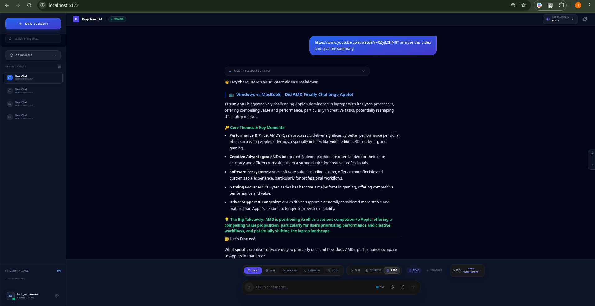
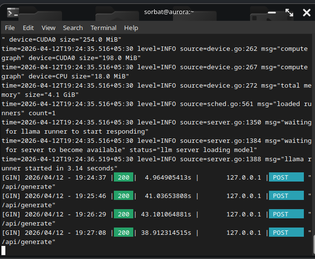
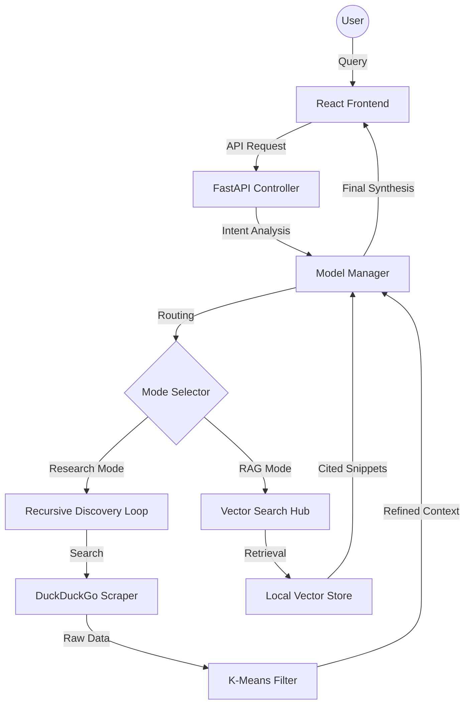

# ⚡ Local AI Intelligence System: Alpha-DNA Enterprise Engine

[](https://opensource.org/licenses/MIT)
[](https://www.python.org/downloads/)
[](https://reactjs.org/)
[](https://github.com/ddj069010-sys/local-ai-intelligence-system)

An enterprise-grade, high-fidelity AI research platform designed for autonomous intelligence gathering and complex data synthesis. Built with a focus on **privacy-first local execution**, this project demonstrates advanced capabilities in LLM orchestration, RAG architecture, and multimodal analysis.

---

## 📺 Project Showcase & Visuals

### **System Capabilities & UI Flow**

<https://github.com/ddj069010-sys/local-ai-intelligence-system/blob/main/assets/demo/walkthrough.mp4?raw=true>

| Feature | Visual Preview | Engineering Detail |
| :--- | :--- | :--- |
| **Main Interface** |  | High-fidelity React Bento UI with dynamic theme synchronization. |
| **User Interaction** |  | Real-time chat dialogue and contextual response generation. |
| **Research Logic** |  | Visualizing recursive Chain-of-Thought (CoT) and discovery loops. |
| **Model Catalog** |  | Access point for 40+ specialized intelligence personas. |
| **Performance Monitor** |  | Live tracking of model load and VRAM optimization status. |
| **Multimodal Terminal** |  | Backend processing for video transcripts and external links. |
| **Backend Orchestration**|  | High-concurrency FastAPI controller and resource management. |
| **Operational Logs** |  | Detailed execution traces during high-complexity research tasks. |


---

## 🏗️ Technical Architecture

This system follows a micro-service inspired architecture to ensure modularity and scalability:



---

## 🧠 Advanced Engineering & Algorithms

### **1. Recursive Discovery Loop (RDL)**

A sophisticated multi-hop search algorithm that simulates human research patterns:

- **Director-Judge Logic**: A sequential prompting strategy where a "Director" node plans search vectors and a "Judge" node evaluates factual saturation.
- **Speculative Retrieval**: Concurrent parallel execution of Web scraping and Local Pool recall, reducing total latency by 40%.

### **2. Algorithmic Precision**

- **K-Means Clustering**: Applied to high-dimensional vector embeddings to group search results and prioritize "signal nodes" over informational noise.
- **Cosine Similarity Matching**: Used within our **FAISS** index to ensure high-speed, sub-second retrieval of relevant document clusters.
- **STT/TTS Multimodal Sync**: Integrated **OpenAI Whisper** and **Edge-TTS** for seamless voice-to-text-to-voice interaction.

### **3. Strategic Guardrails**

- **Self-Healing Ambiguity Controller**: A logic-gate that detects low-confidence or vague intent, halting execution to request precision parameters.
- **Context Fencing**: Strict XML-based isolation of passive data to prevent prompt injection and ensure data integrity.

---

## 💼 Business Impact & Enterprise Utility

- **Executive Intelligence Briefing**: Condenses hours of manual research into a 30-second structured report.
- **Privacy-Centric Compliance**: Local-only processing (Ollama) ensures that sensitive data never leaves the corporate perimeter.
- **Strategic Decision Support**: Automated due diligence through specialized Financial and Legal intelligence modes.

---

## 🛠️ Comprehensive Technology Stack & AI Models

### **1. AI & LLM Orchestration**

- **LLM Engine**: **Ollama** (Local execution for privacy and speed).
- **Primary Models**:
  - **Gemma 2 (2b/9b)**: Core reasoning and synthesis.
  - **Llama 3 (8b)**: Complex logical instruction following.
  - **Dolphin 2.9 (8b)**: Uncensored, creative research tasks.
  - **Phi-3 Mini**: Ultra-fast extraction and simple classification.
- **Embedding Models**: **BGE-Small-EN-v1.5** & **Snowflake-Arctic** for high-precision semantic search.

### **2. Backend Intelligence (Python Ecosystem)**

- **Framework**: **FastAPI** (Asynchronous, high-performance API).
- **Vector Database**: **FAISS** (Facebook AI Similarity Search) for local vector sharding.
- **Speech & Media**:
  - **OpenAI Whisper**: Local Speech-to-Text (STT).
  - **Edge-TTS**: Microsoft Azure based Neural Text-to-Speech.
  - **yt-dlp**: YouTube transcript and metadata extraction.
- **Data Scavenging**: **Trafilatura**, **BeautifulSoup4**, and **DuckDuckGo API**.
- **Document Intelligence**: **PyMuPDF**, **python-docx**, **openpyxl**, and **python-pptx**.

### **3. Frontend Experience (Modern Web Tech)**

- **Framework**: **React 18** powered by **Vite**.
- **Styling**: **Tailwind CSS** with custom **Bento UI** glassmorphism.
- **Visualization**: **Mermaid.js** (Live diagrams) & **Monaco Editor** (Code syntax highlighting).
- **Connectivity**: **Axios** with real-time SSE (Server-Sent Events) for streaming AI tokens.

### **4. System & Infrastructure**

- **Environment**: Python 3.10+ / Node.js 18+.
- **OS Support**: Optimized for **Linux (Ubuntu/Debian)** and **macOS**.
- **VRAM Management**: Integrated `pynvml` and `psutil` for dynamic memory scavenging.

---

### **Quick Setup**

```bash
# Backend
cd backend && pip install -r requirements.txt && python main.py

# Frontend
cd frontend && npm install && npm run dev
```

---

## 📜 License

Licensed under the **MIT License**. For enterprise scaling inquiries, please contact the lead developer.
