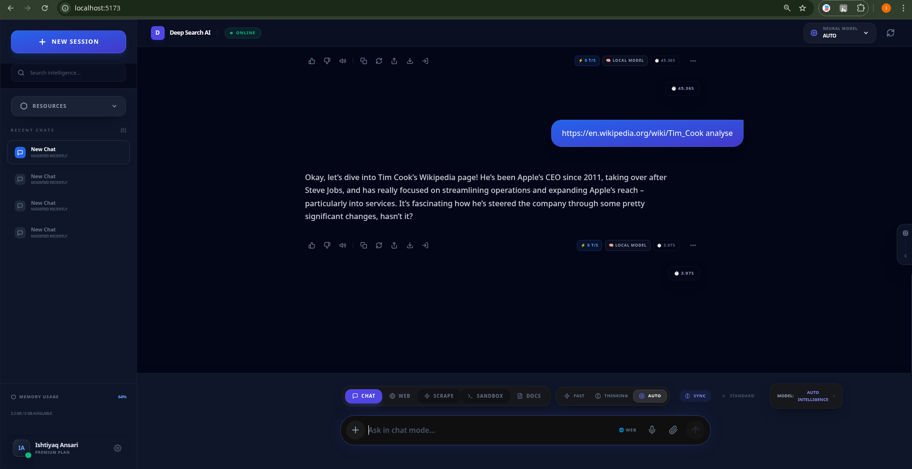
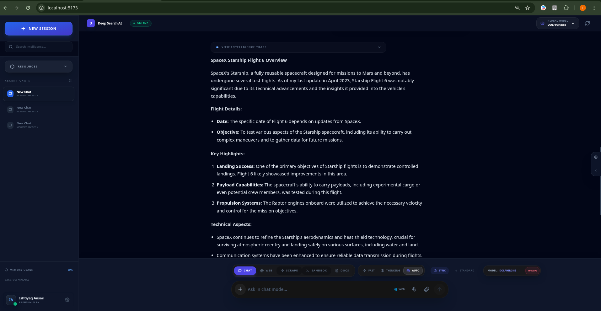
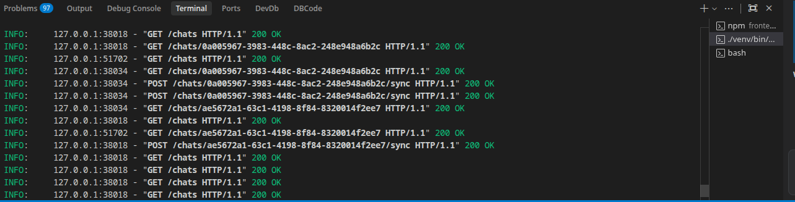

# ⚡ Local AI Intelligence System: Alpha-DNA Research Engine

[](https://opensource.org/licenses/MIT)
[](https://www.python.org/downloads/)
[](https://reactjs.org/)
[](https://vitejs.dev/)

A state-of-the-art, high-fidelity local AI development system designed for autonomous deep-web research, multimodal intelligence, and complex reasoning. This system bridges the gap between local LLMs and real-world data scavenging.

---

## 📺 Demo & Visuals

### **System Walkthrough**
> [!TIP]
> Place your demo video in `assets/demo/walkthrough.mp4` to see it here.


### **Key Interface Insights**
| Feature | Screenshot Preview |
| :--- | :--- |
| **Intelligence Modes** |  |
| **Deep Research Logs** |  |
| **Bento UI Output** |  |

---

## 🧠 Core Intelligence Features

### **1. Recursive Deep Research Pipeline**
The engine doesn't just search; it *thinks*. 
- **Multi-Hop Discovery**: Iteratively generates search queries to fill knowledge gaps.
- **Speculative Retrieval**: Parallelized web scavenging and vector memory recall.
- **Factual Grounding**: Cross-references multiple sources to resolve discrepancies.

### **2. 40+ Specialized Intelligence Personas**
Integrated via a logic-routing layer, the system can switch between 40+ highly-tuned modes:
- **Technical**: Senior Software Architect, Lead Debugger, Cybersecurity Specialist.
- **Scientific**: Mathematical Genius, Astro-Physicist, Senior Chemist, Data Scientist.
- **Professional**: Legal Consultant, Financial Analyst, CMO Strategist, SEO Expert.
- **Creative**: Bestselling Novelist, Professional Writer, UX/UI Architect.
- **Utility**: Nuance Translator, Structural Educator, Comparison Strategist, Project Lead.

### **3. Multimodal Multitool**
- **Video Intelligence**: YouTube transcript extraction and VLM-based frame analysis.
- **Document RAG**: Semantic search over PDFs, DOCX, XLSX, and PPTX.
- **Link Processor**: Advanced scraper with antibot-bypass and dynamic content extraction.

### **4. Self-Healing Intelligence Guard**
- **Ambiguity Controller**: Detects low-confidence or vague queries and halts execution to request technical clarification.
- **Context Fencing**: Prevents prompt injection and memory bleed via strict XML isolation.

---

## 🛠️ Technology Stack

### **Backend (The "Brain")**
- **Framework**: FastAPI (Async high-performance)
- **Search**: DuckDuckGo API, Trafilatura (Scraping)
- **Vector DB**: FAISS (Local CPU-optimized)
- **Processing**: yt-dlp (Video), Whisper (Audio), PyMuPDF (PDF)
- **LLM Node**: Ollama Integration (supports Llama 3, Gemma, Dolphin, Phi-3)

### **Frontend (The "Eyes")**
- **Framework**: React 18 + Vite
- **Styling**: Tailwind CSS (Premium Bento UI aesthetics)
- **Components**: Lucide React (Icons), Mermaid.js (Diagrams), Monaco Editor (Code)
- **Markdown**: React-Markdown with GFM support

---

## 🚀 Installation & Setup

### **Prerequisites**
- **Python 3.10+**
- **Node.js 18+**
- **Ollama** installed and running locally.

### **1. Clone & Backend Setup**
```bash
git clone https://github.com/ddj069010-sys/Local-ai-intelligence-system.git
cd Local-ai-intelligence-system/backend

# Create virtual environment
python -m venv venv
source venv/bin/activate  # On Windows: venv\\Scripts\\activate

# Install dependencies
pip install -r requirements.txt

# Start the Backend
python main.py
```

### **2. Frontend Setup**
```bash
cd ../frontend
npm install
npm run dev
```

---

## 📁 System Architecture
```text
LocalAIDevSystem/
├── assets/                    # Project Visuals (Videos/Screenshots)
├── backend/
│   ├── controller/            # API Routes (Chat, RAG, Link Processing)
│   ├── engine/                # Core AI Logic (Modes, Research, Research)
│   ├── services/              # specialized tools (Scraper, Video, Intelligence)
│   ├── memory/                # Vector store and session management
│   └── main.py                # Server Entrypoint
└── frontend/
    ├── src/
    │   ├── components/        # UI Bento Boxes, Sidebars, Modals
    │   ├── pages/             # Layouts (Chat, Memory, Workspace)
    │   └── App.jsx            # Frontend Core
```

---

## 📜 License
This project is licensed under the **MIT License**. See the [LICENSE](LICENSE) file for details.

---

### **🛡️ Security Disclosure**
This system is designed for local-first intelligence. Use responsibly when scraping external domains. Ensure you comply with `robots.txt` and domain terms of service.
